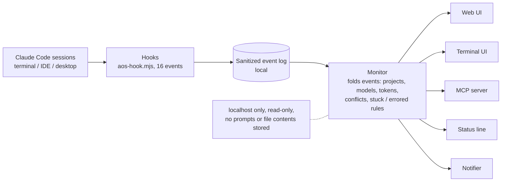

# How it works

```mermaid
flowchart LR
  S["Claude Code sessions<br/>terminal / IDE / desktop"] --> H["Hooks<br/>aos-hook.mjs, 16 events"]
  H --> L[("Sanitized event log<br/>local")]
  L --> M["Monitor<br/>folds events: projects, models, tokens,<br/>conflicts, stuck / errored rules"]
  M --> W["Web UI"]
  M --> T["Terminal UI"]
  M --> P["MCP server"]
  M --> SL["Status line"]
  M --> N["Notifier"]
  NOTE["localhost only, read-only,<br/>no prompts or file contents stored"] -.- M
```
